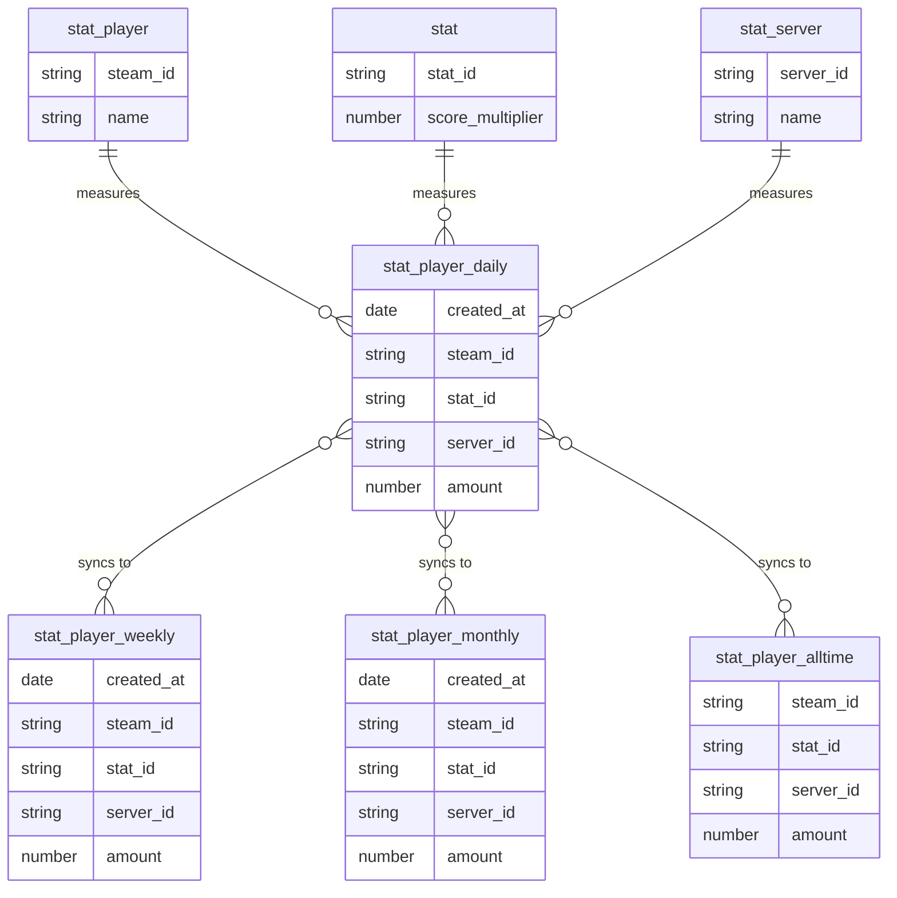

# Stats Tracker

## Installation

To build the mod from source, install [HEMTT] and run the following command:

```sh
hemtt build
```

## Users

- Players (in-game participants)
- Viewers (of the leaderboard, which can also be players)
- Administrators

## Functional Requirements

- [X] System should be able to track an arbitrary number of numerical player statistics
  - [X] Infantry kills, ground kills, ship kills, tank kills, aircraft kills
  - [X] Playtime (minutes)
  - [X] Player deaths and incapacitations
  - [X] Players transported
  - [X] Players revived
  - [X] Score (meta, totality of other stats)
- [X] Player statistics should be tracked in near real-time (e.g. every five minutes)
- [ ] Viewers should be able to see the top players for each statistic in near real-time
      (e.g. updated on page refresh)
- [ ] Viewers should be able to see leaderboards on different time intervals
      (1 day, 1 week, 1 month, all-time)
- [ ] Viewers should be able to see server-specific leaderboards, plus global leaderboard
- [ ] Players should be able to view their own ranks and statistics on each leaderboard
- [ ] Players should be able to view neighbouring player ranks on each leaderboard
- [ ] Players should not appear in leaderboards when no statistics are available
      (e.g. 1-day leaderboard where player X has not gained any stats)
- [ ] Players should see themselves as unranked if no statistics are available
- [ ] (Maybe?) Players should be able to opt-out of leaderboards
- [ ] (Maybe?) Players should be able to opt-out of stats tracking
- [ ] Administrators should be able to create new servers
- [ ] Administrators should be able to reset statistics of specific players
      (e.g. for leaderboard exploiters)

## Design

- [X] Statistics should be synced to a database at least every five minutes
- [X] Server should call stored procedure N x M times to submit each player's stats
- [X] Stored procedure should insert or update daily statistics based on CURRENT_DATE
- [X] Same stored procedure should insert or update `'score'` daily statistic
- [X] Triggers should synchronize daily statistics with weekly, monthly, and all-time statistics
- [X] Daily statistics should be pruned once every month
- [X] Deletion of daily, weekly, or monthly statistics must NOT affect all-time statistics

## Entity-Relationship Diagram


