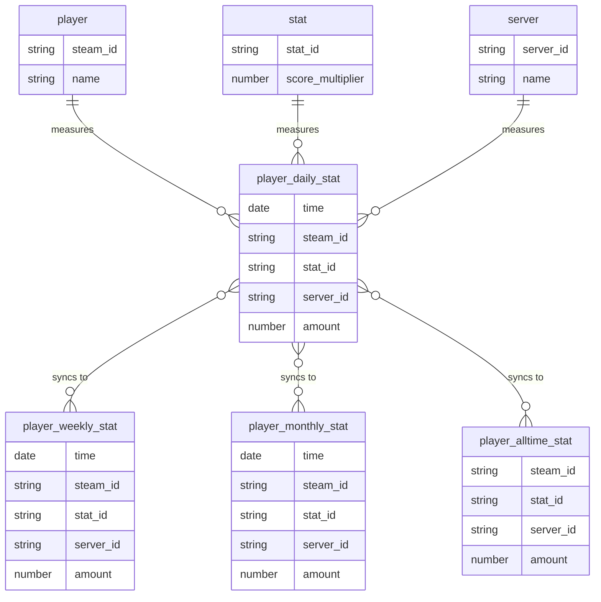

# Stats Tracker

## Installation

To build the mod from source, install [HEMTT] and run the following command:

```sh
hemtt build
```

## Users

- Players (in-game participants)
- Viewers (of the leaderboard, which can also be players)
- Administrators

## Functional Requirements

- [ ] System should be able to track an arbitrary number of numerical player statistics
  - [ ] Infantry kills, ground kills, tank kills, aircraft kills
  - [ ] Playtime (hours)
  - [ ] Player deaths and incapacitations
  - [ ] Players transported
  - [ ] Players revived
  - [ ] Score (meta, totality of other stats)
- [ ] Player statistics should be tracked in near real-time (e.g. every five minutes)
- [ ] Viewers should be able to see the top players for each statistic in near real-time
      (e.g. updated on page refresh)
- [ ] Viewers should be able to see leaderboards on different time intervals
      (1 day, 1 week, 1 month, all-time)
- [ ] Viewers should be able to see server-specific leaderboards, plus global leaderboard
  [ ] Players should be able to view their own ranks and statistics on each leaderboard
- [ ] Players should be able to view neighbouring player ranks on each leaderboard
- [ ] Players should not appear in leaderboards when no statistics are available
      (e.g. 1-day leaderboard where player X has not gained any stats)
- [ ] Players should see themselves as unranked if no statistics are available
- [ ] (Maybe?) Players should be able to opt-out of leaderboards
- [ ] (Maybe?) Players should be able to opt-out of stats tracking

## Design

- [ ] Statistics should be synced to a database at least every five minutes
- [ ] Server should call stored procedure N x M times to submit each player's stats
- [ ] Stored procedure should insert or update daily statistics based on CURRENT_DATE
- [ ] Weekly and monthly statistics should be materialized views of daily statistics
- [ ] Triggers should synchronize daily statistics with all-time statistics (insert/update only)
- [ ] Daily statistics should be pruned once every month
- [ ] Deletion of daily statistics must NOT affect all-time statistics

## Entity-Relationship Diagram


