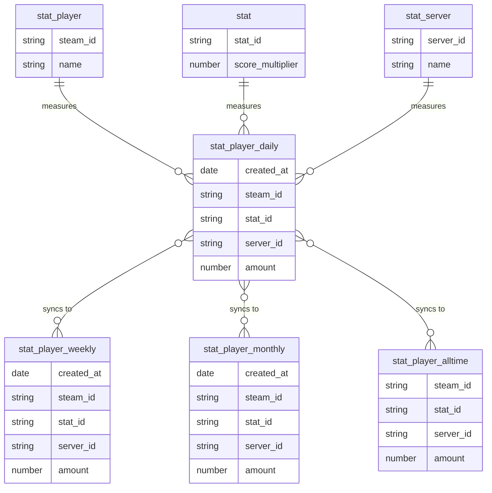

# Stats Tracker

A server-side Arma 3 mod for tracking player statistics. Integrated with [extDB3].

This mod is **not** batteries-included; we do not provide any user interface
for viewing player stats, not even in-game.
Rather, this mod is intended to be one component of a leaderboard system.

It can be hooked up to a web dashboard, Discord bot, or an in-game leaderboard,
as long you can write software that reads player stats saved to your MySQL
or MariaDB instance.

[extDB3]: https://github.com/SteezCram/extDB3

## Prerequisites

1. An Arma 3 server that you can install and configure extDB3 on (see their [wiki])
2. A MariaDB instance, with username/password credentials

   In addition, it is recommended to have two separate users for security,
   one that can create the database schema, and another user with restricted
   privileges that extDB3 can use for inserting and updating stats.

   In abscence of this however, the `fdelta_stats.ini` configuration
   defines prepared statements to prevent executing arbitrary SQL,
   and extDB3 is automatically locked after a delay
   (see [Automatic Locking](#automatic-locking)).


[wiki]: https://github.com/SteezCram/extDB3/wiki

## Installation

The latest version of the mod can be found in the [Releases] page
as one of the downloadable asset files.

If you want to build the mod from source, install [HEMTT] and run the following
command from your repository clone:

```sh
hemtt build
```

Since this is a server-side mod, it does not need to be signed.

[Releases]: https://github.com/thegamecracks/420th-Stats-Tracker/releases/latest
[HEMTT]: https://github.com/brettmayson/HEMTT

## Setup

Once you have extDB3 and this mod installed, follow the configuration examples
in our [@extDB3] directory. Your server should have:

1. `@extDB3/extdb3-conf.ini`: this must define an `fdelta_stats_db` table
   with the address, database, and credentials for your MySQL instance.
2. `@extDB3/sql_custom/fdelta_stats.ini`: this contains the queries that the
   mod will use. You do not need to edit anything here.

As well, `@extDB3/schema/` contains one or more .sql scripts that you need to
execute on your database to create the necessary tables.
If you already have an existing setup on your instance, you may want to create
a separate database and user for this mod. Make sure to run these scripts on
the database matching your extDB3 configuration.

After you have finished setting this up, start your server and look for logs
containing the phrase, `fdelta_stats`. You should see a log entry indicating
whether the mod was successfully able to set up the database.

Alternatively, you can run the mod without using extDB3, in which case stats
are only tracked in a local SQF hashmap and are lost on mission restart
(see [Introspecting Stats](#introspecting-stats)).

[@extDB3]: /@extDB3/

## Entity-Relationship Diagram


```mermaid
erDiagram
    stat_player {
        string steam_id
        string name
    }
    stat {
        string stat_id
        number score_multiplier
    }
    stat_server {
        string server_id
        string name
    }
    stat_player_daily {
        date created_at
        string steam_id
        string stat_id
        string server_id
        number amount
    }
    stat_player_weekly {
        date created_at
        string steam_id
        string stat_id
        string server_id
        number amount
    }
    stat_player_monthly {
        date created_at
        string steam_id
        string stat_id
        string server_id
        number amount
    }
    stat_player_alltime {
        string steam_id
        string stat_id
        string server_id
        number amount
    }
    stat_player ||--o{ stat_player_daily : "measures"
    stat ||--o{ stat_player_daily : "measures"
    stat_server ||--o{ stat_player_daily : "measures"
    stat_player_daily }o--o{ stat_player_weekly : "syncs to"
    stat_player_daily }o--o{ stat_player_monthly : "syncs to"
    stat_player_daily }o--o{ stat_player_alltime : "syncs to"
```

## Available Stats

The following stats are tracked by this mod:
- `deaths`: the number of times a player has died.
- `incaps`: the number of times a player has been incapacitated.
- `kills`: the number of (hostile) infantry kills a player has earned.
- `kills_air`: the number of (hostile) aircraft kills a player has earned.
- `kills_cars`: the number of (hostile) vehicular kills a player has earned.
- `kills_ships`: the number of (hostile) ship kills a player has earned.
- `kills_tanks`: the number of (hostile) tank kills a player has earned.
- `playtime`: the amount of playtime earned by a player, in minutes.
- `revives`: the number of units revived by a player (see [Tracking Revive Stats](#tracking-revive-stats))
- `score`: the total score computed from other stats.
- `transports`: the number of players transported at least 2km by a given player (see [fn_statsTrackTransportsOnGetOutMan.sqf]).

[fn_statsTrackTransportsOnGetOutMan.sqf]: /addons/main/Functions/Stats/fn_statsTrackTransportsOnGetOutMan.sqf

## Introspecting Stats

All non-persisted statistics are stored in `localNamespace` with the variable,
`fdelta_stats_current`, containing a hashmap of hashmaps mapping stat IDs to
steam IDs and their quantities.
You can check this by server-executing the following code from debug console:

```sqf
localNamespace getVariable "fdelta_stats_current"
```

When the mod synchronizes these stats to the database, a new hashmap is created
and it replaces the existing hashmap.

You can see the quantity of statistics submitted from server logs every five minutes.
If the mod failed to set up the database, these stats are never persisted and as such,
the stats will always be available for the current mission in `fdelta_stats_current`.

## Tracking Revive Stats

While most stats work out of the box, revive tracking does not as revive systems
are not a native Arma 3 mechanism and have to be scripted.

If you're the developer of a gamemode or mod that includes a revive system,
you can add support for this stat by setting the following variable on any unit
that has been revived:

```sqf
// Client-side:
_incapped setVariable ["fdelta_stats_revived_by", player, 2];
// Server-side:
_incapped setVariable ["fdelta_stats_revived_by", _reviver];
```

You can see the client-side example in [Warriors Haven Framework].

Every ten seconds, the server mod checks this variable on all players,
clears them if present, and adds the reviver to the stats hashmap.
Non-player units are not checked to save on performance, but this can
be modified in [fn_statsTrackRevives.sqf].

[Warriors Haven Framework]: https://github.com/Warriors-Haven-Gaming/WHFramework/blob/3530c52bf1d887f2a4d6f0efac3d4280e0c490cf/WHFramework.Altis/Functions/Revive/fn_reviveAction.sqf#L98-L100
[fn_statsTrackRevives.sqf]: /addons/main/Functions/Stats/fn_statsTrackRevives.sqf

## Automatic Locking

For additional security, the mod will call extDB3's [LOCK] command one minute
after mission start to prevent re-configuring extDB3. This can be disabled
with any mission script or mod that sets the `missionNamespace` variable,
`fdelta_stats_fnc_dbInit_lock_skip`.

Alternatively, you can rebuild this mod to remove the LOCK command from
the [fn_dbInit.sqf] function.

[LOCK]: https://github.com/SteezCram/extDB3/wiki/extDB3---System#lock
[fn_dbInit.sqf]: /addons/main/Functions/Database/fn_dbInit.sqf

## Multi-Server Usage

The schema contains a `server_id` column that can be used to distinguish statistics
from different servers. However, the mod uses the server ID "main" by default,
and it does not have a way to configure this server ID without rebuilding the mod.

At the moment, you must edit the mod from source, specifically the [fn_dbSyncLoop.sqf]
function containing the server ID, and then re-build the mod and upload it to the corresponding
server. I suggest renaming the mod directory to help you remember which server ID
it saves to, e.g. `@fdelta_stats_server2`.

[fn_dbSyncLoop.sqf]: /addons/main/Functions/Database/fn_dbSyncLoop.sqf

## Functional Requirements

This section describes requirements for a theoretical leaderboard system
to be combined with this mod.

Users:
- Players (in-game participants)
- Viewers (of the leaderboard, which can also be players)
- Administrators

Requirements:
- [X] System should be able to track an arbitrary number of numerical player statistics
  - [X] Infantry kills, ground kills, ship kills, tank kills, aircraft kills
  - [X] Playtime (minutes)
  - [X] Player deaths and incapacitations
  - [X] Players transported
  - [X] Players revived
  - [X] Score (meta, totality of other stats)
- [X] Player statistics should be tracked per-server
- [X] Player statistics should be tracked in near real-time (e.g. every five minutes)
- [ ] Viewers should be able to see the top players for each statistic in near real-time
      (e.g. fetched on request and cached for five minutes)
- [ ] Viewers should be able to see leaderboards on different time intervals
      (1 day, 1 week, 1 month, all-time)
- [ ] Viewers should be able to see server-specific leaderboards, plus global leaderboard
- [ ] Players should be able to view their own ranks and statistics on each leaderboard
- [ ] Players should be able to view neighbouring player ranks on each leaderboard
- [ ] Players should not appear in leaderboards when no statistics are available
      (e.g. 1-day leaderboard where player X has not gained any stats)
- [ ] Players should see themselves as unranked if no statistics are available
- [ ] (Maybe?) Players should be able to opt-out of leaderboards
- [ ] (Maybe?) Players should be able to opt-out of stats tracking
- [ ] Administrators should be able to create new servers
- [ ] Administrators should be able to reset statistics of specific players
      (e.g. for leaderboard exploiters)

## Mod Design

- [X] Statistics should be synced to a database at least every five minutes
- [X] Game server should call stored procedure up to N x M times to submit
      each player's changes in stats

## Database Design

- [X] Stored procedure should insert or update daily statistics based on CURRENT_DATE
- [X] Same stored procedure should insert or update `'score'` daily statistic
- [X] Triggers should synchronize daily statistics with weekly, monthly, and all-time statistics
- [X] Daily, weekly, and monthly statistics should be pruned once every month
- [X] Deletion of daily, weekly, or monthly statistics must NOT affect all-time statistics

## License

This project is written under the [MIT License].

[MIT License]: /LICENSE
